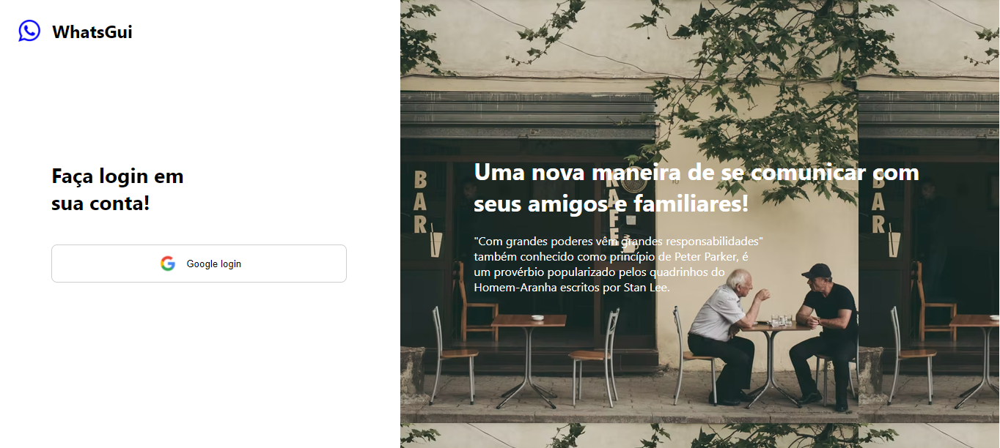
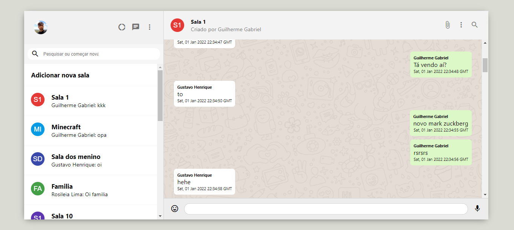

# Clone of whatsapp web with react and firebase

## To run, open https://whatsgui.web.app/ or:
`1º: git clone git@github.com:GuilhermeGabriel/whatsapp-web-clone.git` 
`2º: cd whatsapp-web-clone.git` 
`3º: change api keys variables of firebase in .env` 
`4º: yarn or npm install` 
`5º: yarn start or npm start` 

## Screeenshots
 
 

